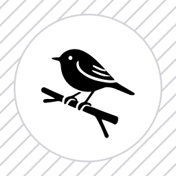

<p align="center">
  
</p>

# Robin

[PyLoT Robotics](https://pylot.kaijo-physics.club)で制作しているロボットのデバッグ用コントローラーです。

# 実行手順
```bash
ros2 launch rosbridge_server rosbridge_websocket_launch.xml #RosBridge Serverの起動
ros2 run robin video_publisher #動画配信用のノードの起動
ros2 run robin client #アプリの起動(表示されるQRコードから開けます)
```
